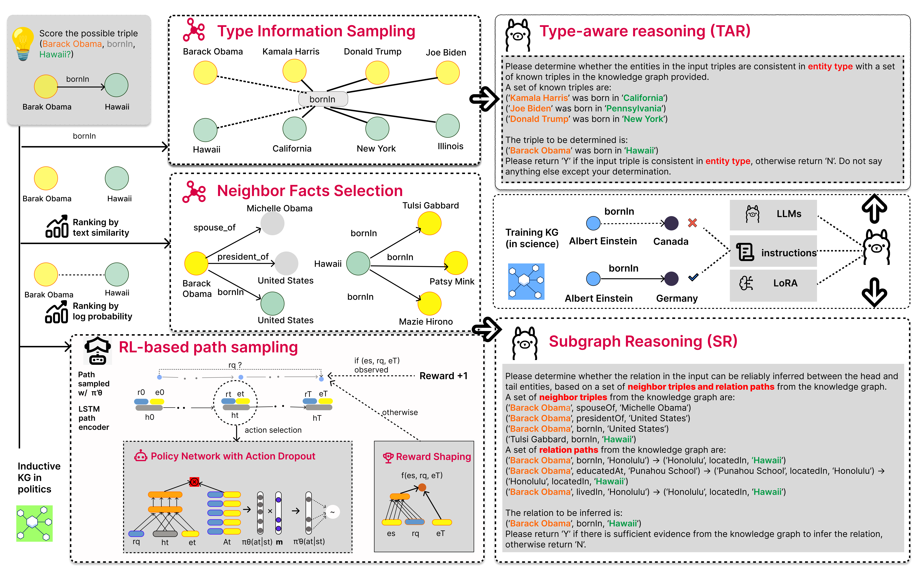

# [PAKDD 2026] RLKGC: Reinforcement Learning Retrieval with Large Language Models for Knowledge Graph Completion

This repository provides the official implementation of the paper  
*"RLKGC: Reinforcement Learning Retrieval with Large Language Models for Knowledge Graph Completion"*.




## 📌 Overview

RLKGC is a unified framework that integrates:

- 🔵 **multihopRL** — Reinforcement Learning with Reward Shaping for multi-hop knowledge graph reasoning  
- 🟢 **KGC** — LLM-based reasoning with type-aware subgraph and path-aware retrieval  

The complete pipeline consists of two stages:

1. **RL-based Path Retrieval**
2. **LLM-based Reasoning over Retrieved Paths**

---

## 📁 Repository Structure

```
RLKGC/
├── multihopRL/      # RL + reward shaping module           
└── KGC              # LLM-based reasoning module
```

---

## ⚙️ Environment Setup

Recommended configuration:

- Python 3.10  
- PyTorch ≥ 2.2  
- CUDA-enabled GPU  

Create environment:

```
conda create -n rlkgc python=3.10
conda activate rlkgc
pip install -r requirements.txt
pip install sentence_transformers
```

---

## 📂 Datasets

We evaluate RLKGC on:

- FB15k-237  
- WN18RR  
- NELL-995  

⚠️ Datasets are **NOT included** in this repository.

Please download `data-release.tgz` from the official MultiHopKG repository  
[Download here](https://github.com/salesforce/MultiHopKG/blob/master/data-release.tgz)

Unpack:

```
tar xvzf data-release.tgz
```

Place the extracted datasets under:

```
multihopRL/data/
```

For the LLM module, download the full dataset and instruction files from  
[Dataset & Instructions link](https://drive.google.com/drive/folders/17C3BsllCWy_TK3B5WwCjxPQo2heuLJPz)

Then copy the `datasets/` and `instructions/` folders into:

```
KGC/
```

---

## 🔵 Stage 1: multihopRL (RL-based Retrieval)

### 1️⃣ Process Data

```
./experiment.sh configs/<dataset>.sh --process_data <gpu-ID>
```

Available datasets:

- fb15k-237  
- wn18rr  
- nell-995  

---

### 2️⃣ Train Embedding Model

Supported embedding models:

- distmult  
- complex  
- conve  

```
./experiment-emb.sh configs/<dataset>-<embedding_model>.sh --train <gpu-ID>
```

Optional evaluation:

```
./experiment-emb.sh configs/<dataset>-<embedding_model>.sh --inference <gpu-ID>
```

---

### 3️⃣ Train RL + Reward Shaping

Edit configuration file:

```
nano configs/<dataset>-rs.sh
```

Set embedding checkpoint path:

```
complex_state_dict_path="model/<your_pretrained_embedding>/best_dev_iteration.dat"
```

Train:

```
./experiment-rs.sh configs/<dataset>-rs.sh --train <gpu-ID>
```

Inference:

```
./experiment-rs.sh configs/<dataset>-rs.sh --inference <gpu-ID>
```

Generated path file:

```
multihopRL/outputs/<dataset>_cats.jsonl
```

---

## 🟢 Stage 2: KGC (LLM-based Reasoning)

### 1️⃣ Install Dependencies

```
pip install -r requirements.txt
pip install sentence_transformers
```

---

### 2️⃣ Convert Retrieved Paths (Inductive Setting)

```
python tools/convert_<your_dataset>_paths.py
```

This generates:

```
datasets/<dataset>/paths/close_path.json
```

---

### 3️⃣ (Optional) Build Instructions

```
python build_instructions.py \
  --dataset <your_dataset> \
  --train_size full \
  --prompt_type CATS \
  --subgraph_type combine \
  --neg_num 12
```

---

## 🤖 LLM Setup

Experiments can be reproduced using:

- Qwen2-7B-Instruct  
- Meta-Llama-3-8B-Instruct  
- Qwen2-1.5B-Instruct  

Download model checkpoints from:

- Qwen2-7B-Instruct: [Model Link](https://huggingface.co/Qwen/Qwen2-7B-Instruct)
- Meta-Llama-3-8B-Instruct: [Model Link](https://huggingface.co/meta-llama/Meta-Llama-3-8B-Instruct)
- Qwen2-1.5B-Instruct: [Model Link](https://huggingface.co/Qwen/Qwen2.5-1.5B-Instruct)


---


## 🧠 Instruction-Tuning (Supervised Fine-Tuning)

We adopt **[LLaMA-Factory](https://github.com/hiyouga/LlamaFactory)** for supervised fine-tuning (SFT) of the base LLM using the generated instruction prompts.


Please follow the installation and training instructions provided in the official repository.

During fine-tuning, you need to:

- Specify the path to the generated instruction prompts
- Set the base model checkpoint (e.g., Qwen2-7B-Instruct or Meta-Llama-3-8B-Instruct)
- Configure training hyperparameters (learning rate, batch size, LoRA configuration, etc.)

The detailed hyperparameter settings used in our experiments are described in the paper.

After fine-tuning, update the model path in:

```
KGC/data_manager.py
```

Set:

```
LLM_PATH = "<path_to_your_finetuned_model>"
```

---


## 🚀 Inference

Example (Inductive Setting):

```
python prediction.py \
  --dataset <your_dataset> \
  --setting inductive \
  --train_size full \
  --model_name <model_path> \
  --llm_type sft \
  --prompt_type CATS \
  --subgraph_type combine \
  --path_type degree
```

To run in transductive setting:

```
--setting transductive
```

---

## ⚠️ Important Note for NELL-995

For NELL-995, the original training data is split into `train.triples` and `dev.triples`.  
For final evaluation, the model must be trained using both files combined.

To obtain correct test results, include the `--test` flag in all preprocessing, training, and inference commands.

Process data:

```
./experiment.sh configs/nell-995.sh --process_data <gpu-ID> --test
```

Train embedding model:

```
./experiment-emb.sh configs/nell-995-conve.sh --train <gpu-ID> --test
```

Train RL + Reward Shaping:

```
./experiment-rs.sh configs/NELL-995-rs.sh --train <gpu-ID> --test
```

Inference:

```
./experiment-rs.sh configs/NELL-995-rs.sh --inference <gpu-ID> --test
```

⚠️ During development, leave out the `--test` flag.

---

## 📊 Outputs

RL retrieval outputs:

```
multihopRL/outputs/<dataset>_cats.jsonl
```

LLM predictions:

```
KGC/outputs/
```

---

# 📜 Citation

If you use this code, please cite:

```
Accepted at PAKDD 2026.  
Citation information will be updated upon publication.
```

---

## 🔒 Notes

- Datasets, logs, and model checkpoints are excluded from this repository.
- Ensure correct GPU assignment before training.
